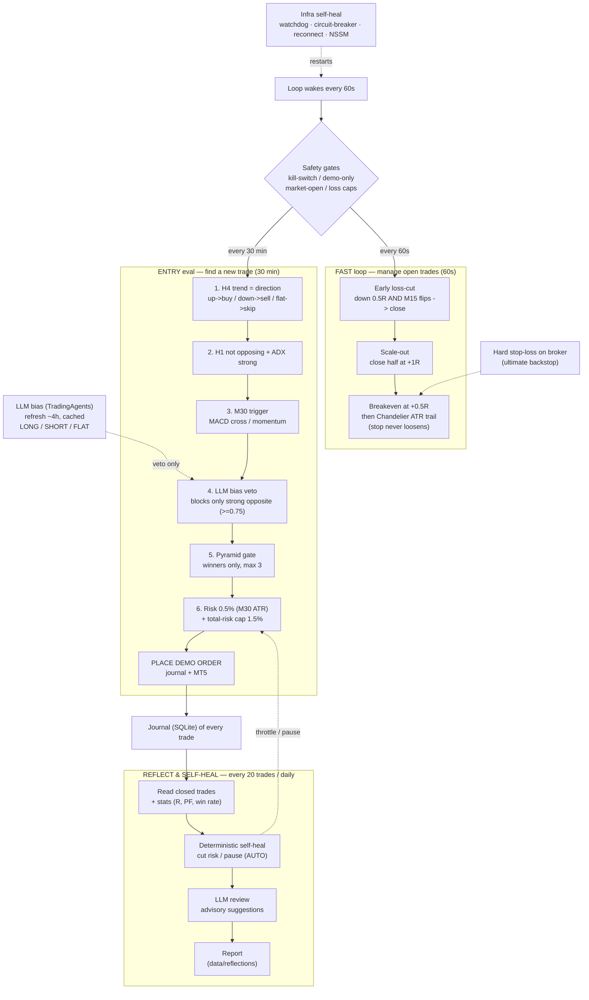

# GoldTrader — System Flow

Two-speed autonomous XAUUSD trader: **TradingAgents LLM bias** (slow) + **deterministic technical timing & protection** (fast).

> Visual version: open [`system-flow.excalidraw`](system-flow.excalidraw) with the
> **Excalidraw** VS Code extension. The Mermaid diagram below renders on GitHub and in
> VS Code's Markdown preview (with a Mermaid extension).



## How it works

**Every 60 seconds** the loop wakes, clears the safety gates, then runs **two lanes**:

### FAST lane — protect open trades (deterministic, no LLM)
1. **Early loss-cut** — if a trade is down ≥0.5R *and* the M15 trend flipped against it, close it now (don't ride to the full stop).
2. **Scale-out** — bank half the position at +1R.
3. **Breakeven + Chandelier trail** — at +0.5R the stop moves to entry, then trails to `swing extreme ∓ ATR×1.5`, ratcheting only in your favor.
- The broker-side **hard stop** is always present as the ultimate backstop.

### ENTRY lane — find a new trade (every 30 min)
1. **H4 trend** sets the direction (up→buy, down→sell, flat→skip).
2. **H1** must not oppose + **ADX** confirms trend strength.
3. **M30 trigger** (MACD cross / momentum) times the entry.
4. **LLM bias veto** — the cached TradingAgents view can only *block* a strongly-opposite trade.
5. **Pyramid gate** — only add into winners, up to 3 positions.
6. **Risk sizing** 0.5% per trade (M30 ATR stop) + a **1.5% total-risk cap**, then **place the order**.

### Self-heal & learning (V6)
Two kinds of self-healing run independently:

- **Infrastructure self-heal (always on):** retry/backoff, circuit-breaker (forces HOLD after repeated failures), heartbeat + watchdog (restarts a hung process), MT5 auto-reconnect, NSSM auto-restart. Heals *crashes/API/connection* problems.
- **Strategy self-heal + learning (reflect loop, every ~20 trades / daily):**
  1. Read all closed trades from the journal and compute stats (win rate, expectancy, profit factor, loss streaks, by-direction).
  2. **Deterministic self-heal (AUTO):** on losing streaks / negative expectancy it cuts position size or pauses new entries until recovery — it can only ever make trading *safer*.
  3. **LLM review (advisory):** an LLM analyses recent losers + current parameters and writes *suggestions* to `data/reflections/` — these are **never auto-applied**, and are gated until ≥20 closed trades. Suggestions are confined to a whitelist that can never touch risk %, loss caps, or the demo guard.

Plus a **bias-aware exit** (fast loop): if the cached LLM bias turns against an open trade with enough conviction, the trade is closed/tightened. Run `python -m goldtrader.cli reflect` to produce a report on demand.

## Regenerate the diagram

```powershell
.venv\Scripts\python.exe scripts\gen_flowchart.py   # rewrites system-flow.excalidraw
```
